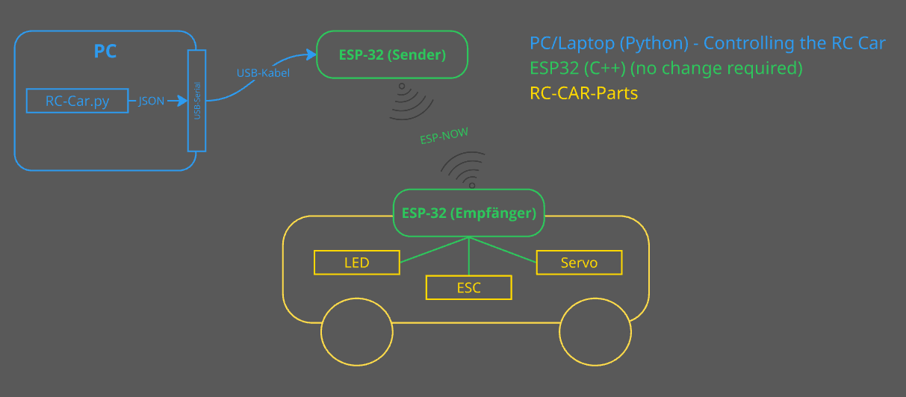

# RC_CAR

This project was created as a programming exercise for Python. Originally, my wife wanted to learn programming, so I designed this project for her. It combines many basic skills from the STEM/Maker world: electronics, programming, laser-cutting, soldering, 3D printing, communicaton and more. The result is not only educational, but also fun for kids!

With this project, my wife learned Python by controlling the RC car. The sender/receiver modules (in C++) were provided by me and do not need to be changed. The idea was that she could control the RC car using Python, while the C++ sender/receiver handle the communication and hardware control.

## RC Car Model

The Car is based on the following 3D-printed RC car from Thingiverse: [https://www.thingiverse.com/thing:3685946](https://www.thingiverse.com/thing:3685946)


## Project Structure

- **ESP32_CPP_SENDER**  
  Sends control commands (as JSON) via ESP-NOW to the receiver (RC car).  
  - `src/main.cpp`: Reads JSON commands via USB (Serial) and sends them via ESP-NOW.
  - `platformio.ini`: PlatformIO configuration (Board: Wemos D1 Mini32, Framework: Arduino).
  - `include/README`: Notes on header files.
  - `test/README`: Notes on unit tests.
  - `.gitignore`, `.vscode/`: Development environment and ignore rules.

- **ESP32_CPP_RECIVER**  
  Receives control commands and controls the servo, ESC, and LED.  
  - `src/main.cpp`: Receives JSON commands via ESP-NOW, controls the steering servo, ESC (motor), and LED.
  - `platformio.ini`: PlatformIO configuration (Board: Wemos D1 Mini32, Framework: Arduino, additional libraries: ESP32Servo, ArduinoJson).
  - `include/README`, `test/README`: Notes on header files and unit tests.
  - `.gitignore`, `.vscode/`: Development environment and ignore rules.

- **ESP32_PYTHON_CONTROL**  
  Python script for controlling and testing communication.  
  - `sender_test.py`: Sends random control commands as JSON via serial interface to the sender.


## How It Works

- Control commands are sent as JSON objects from the Python script (`sender_test.py`) via serial interface to the sender (`ESP32_CPP_SENDER`).
- The sender forwards the commands via ESP-NOW to the receiver (`ESP32_CPP_RECIVER`).
- The receiver processes the JSON commands and controls the steering servo, ESC, and LED accordingly.

**Flow:**
- The Python script sends JSON commands via USB serial to the ESP32 Sender.
- The Sender forwards these commands wirelessly (ESP-NOW) to the ESP32 Receiver.
- The Receiver processes the commands and controls the hardware: steering servo, motor ESC, and LED on the RC car.

Schematic:



### Example JSON

```json
{
  "servo": 45,
  "esc": 1600,
  "led": true,
  "buzzer": false
}
```


## Requirements

- PlatformIO for ESP32 development (Arduino Framework)
- Recommended VS Code extension: `platformio.platformio-ide`
- Python 3 for the test script


## Installation & Usage

1. **Flash the firmware:**  
  - Adjust the receiver's MAC address in the sender code if necessary.
  - Compile and flash both ESP32 modules using PlatformIO.

2. **Run the Python script:**  
  - Adjust the COM port in `sender_test.py`.
  - Start the script to send test commands.

3. **Control the car:**  
  - The receiver processes the commands and controls the hardware.


## Tests

- The `test` directories are intended for unit tests with PlatformIO.


## Notes

- Communication is handled via ESP-NOW (fast, no WiFi required).
- The hardware pins for servo and ESC are defined in the code (e.g., pin 27 for servo, pin 25 for ESC)..
- There is a Timeout mechanism in the receiver (Car): Sets ESC to neutral if no commands are received..
